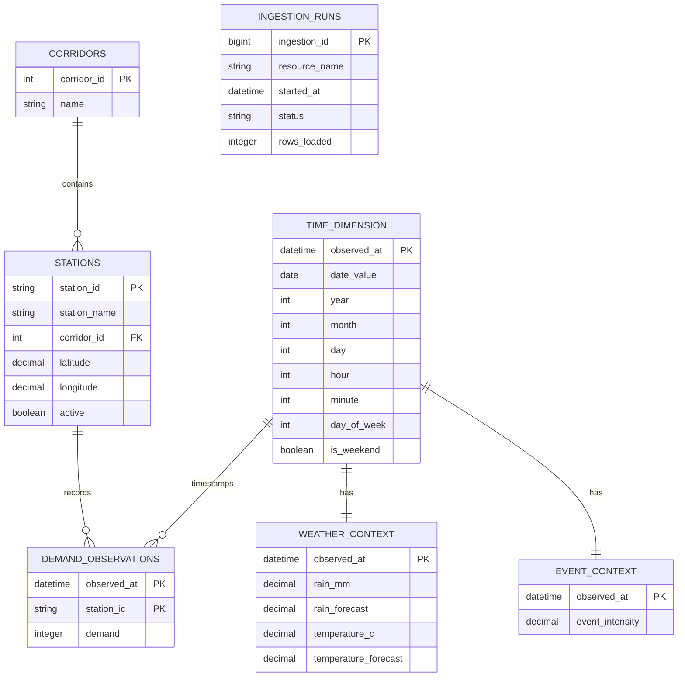

# Modelo ER para Supabase — Pulso TransMi

Esquema recomendado para PostgreSQL/Supabase. La tabla de hechos es
`demand_observations`; las dimensiones describen estaciones, tiempo, clima y
eventos.

## Tablas

| Tabla | Granularidad | Clave |
|---|---|---|
| `corridors` | Un registro por corredor | `corridor_id` |
| `stations` | Un registro por estación | `station_id` |
| `time_dimension` | Un registro por instante de 15 minutos | `observed_at` |
| `weather_context` | Un registro por instante | `observed_at` |
| `event_context` | Un registro por instante | `observed_at` |
| `demand_observations` | Una estación en un instante | `(observed_at, station_id)` |
| `ingestion_runs` | Una ejecución de carga desde la API | `ingestion_id` |

## Decisiones importantes

- Usar `TIMESTAMPTZ` para `observed_at`.
- Usar `VARCHAR` para `station_id`, conservando ceros iniciales como `03000`.
- La relación entre contexto y demanda se realiza por `observed_at`.
- `demand_observations` debe tener índices por `(station_id, observed_at)` y
  `observed_at`.
- `ingestion_runs` permite auditar cuándo y cuántas filas fueron cargadas.

El SQL completo está descrito en la sección de esquema relacional del modelo
general y puede ejecutarse desde el SQL Editor de Supabase.
