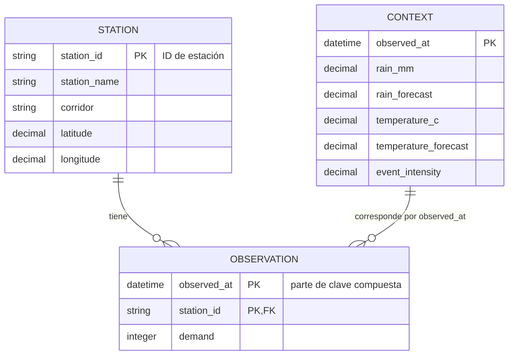

# Modelo entidad-relación de Pulso TransMi

El modelo se deriva de los recursos públicos de la API y de los archivos CSV
descargados. La clave de estación es texto para conservar ceros iniciales.



## Entidades y claves

| Entidad | Fuente API | Clave primaria | Descripción |
|---|---|---|---|
| `STATION` | `GET /v1/stations` | `station_id` | Catálogo geográfico de estaciones. |
| `OBSERVATION` | `GET /v1/observations` | `(observed_at, station_id)` | Demanda observada por estación y momento. |
| `CONTEXT` | `GET /v1/context` | `observed_at` | Variables climáticas y eventos por momento. |

## Relaciones

- Una `STATION` puede tener muchas `OBSERVATION`; cada observación pertenece a
  una estación (`OBSERVATION.station_id` → `STATION.station_id`).
- Un registro `CONTEXT` se asocia temporalmente con las observaciones que tienen
  el mismo `observed_at`. Esta relación es lógica: el recurso de contexto no
  contiene `station_id`.
- La granularidad temporal es de 15 minutos. `observed_at` debe manejarse como
  fecha-hora con zona horaria (en los CSV descargados aparece normalizado a UTC).

## Esquema relacional sugerido

```sql
CREATE TABLE station (
    station_id   VARCHAR(10) PRIMARY KEY,
    station_name TEXT NOT NULL,
    corridor     TEXT NOT NULL,
    latitude     DECIMAL(10, 8) NOT NULL,
    longitude    DECIMAL(11, 8) NOT NULL
);

CREATE TABLE context (
    observed_at          TIMESTAMPTZ PRIMARY KEY,
    rain_mm              DECIMAL,
    rain_forecast        DECIMAL,
    temperature_c        DECIMAL,
    temperature_forecast DECIMAL,
    event_intensity      DECIMAL
);

CREATE TABLE observation (
    observed_at TIMESTAMPTZ NOT NULL,
    station_id  VARCHAR(10) NOT NULL REFERENCES station(station_id),
    demand      INTEGER NOT NULL,
    PRIMARY KEY (observed_at, station_id),
    FOREIGN KEY (observed_at) REFERENCES context(observed_at)
);
```

La última clave foránea requiere cargar primero `context`. Si se permiten
observaciones sin contexto, puede omitirse esa restricción y conservar la unión
temporal como relación lógica.

